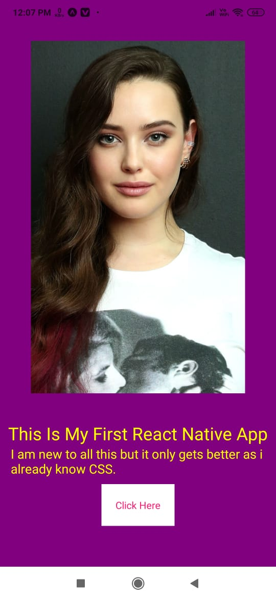

# MyFirstReactNativeExpoApp

## I used React Native Expo to make this app. This was my First App using React Expo.

## Pictures -

 

### I made this using React Expo , now back then i had a low end pc with 32 bit processor so i was not able to install build tools for android development and my seniors told me to start with React Native but that was really hard as i cant run the emulator and was getting many errors while installing android sdk, so what i did i opened the SNACK editor for React Expo and made this app over there (website),imported the code, and push it to github, now how what's the best part about SNACK editor?, you can see the app design on the website it self, or you can jus download ExpoGo from playstore and scan the QR code to view the app on your phone(this is exactly what i did).

## Thus snack editor proves the fact that you dont need a high end pc to create apps, or practice android development, you can do all of that on the website itself.

### Date- 27-05-2021
